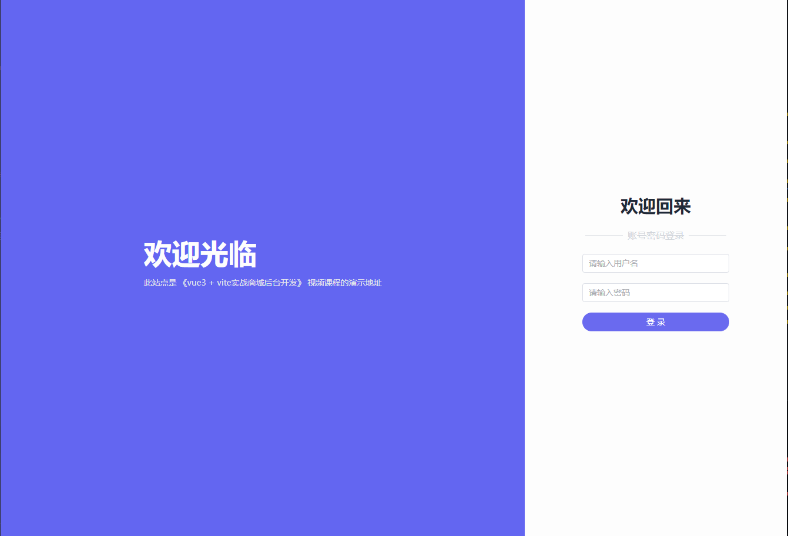

## 配置项目

### 1. vite

```shell
#1. 新建 vite 工程及安装 VSCode 插件 
 > npm init vite@latest shop-admin -- --template vue 
 > npm install
 > npm run dev

#2. VSCode 程序插件安装
 > volar
 > Vue 3 Snippets
```

### 2. ElementPlus

```shell
#1. 安装
 > npm install element-plus --save

#2. 引入 (main.js)
 import ElementPlus from 'element-plus'      `//引入组件` 
 import 'element-plus/dist/index.css'        `//引入组件` 
 createApp(App).use(ElementPlus).mount('#app')   `//应用组件` 
```

### 3. windi css

```shell
#1. 安装
 > npm i -D vite-plugin-windicss windicss

#2. 引入 (vite.config.js)
 import WindiCSS from 'vite-plugin-windicss'  `//引入组件`
 export default defineConfig({
 	plugins: [vue(), WindiCSS(),],			 `//引入组件`
 })

#3. 引入 (main.js) 
 import 'virtual:windi.css'					   `//引入组件`
 createApp(App).use(ElementPlus).mount('#app')

#4. 插件安装
 > windicss
```

### 4. vue-router4

```shell
#1. 安装
 > npm install vue-router@4

#2. 创建文件夹及文件
 > src\router                               `//建立新文件夹`
 > src\router\index.js                      `//建立新文件`
 
#3. 定义路由 (router\index.js)  
 `//引入组件`
 import { 
 	createRouter,
 	createWebHashHistory                    
 } from 'vue-router'
 `//定义路由`
 const routes = []                          
 `//创建路由实例`
 const router = createRouter({              
 	history: createWebHashHistory(),
    routes: routes
 })
 export default router

#4. 创建及加载实例 (main.js)  
 import router from './router'              `//引入文件`
 createApp(App).use(ElementPlus).use(router).mount('#app')   `//应用文件`
```

### 5. alias

```shell
#1. 引入路径模块 (vite.config.js)
 import path from "path"

#2. 定义别名地址
 export default defineConfig({
 	resolve: {
    	alias: {
      		"~": path.resolve(__dirname, "src")   `// src路径 -> ~`
    	}
	},
	plugins: [vue(), WindiCSS(),],
 })
```

### 6. 404 页面

```shell
#1. 创建文件夹 pages
 > src\pages           `//用于存放页面文件`

#2. 创建页面路由 (src\router\index.js)
 `//引入页面文件`
 import Index from '~/pages/index.vue'
 import NotFound from "~/pages/404.vue"
 `//配置页面路由`
 const routes = [
 {
    path: "/", component: Index
 }, {
 	path: '/:pathMatch(.*)*', name: 'NotFound', component: NotFound
 }]

#3. 创建 404 页面页面 (src\pages\404.vue)
 `//通过 element-plus 提供 Result 结果 `
 <template>
    <div>
        <el-result icon="warning" title="404提示" sub-title="你找的页面走丢了~">
            <template #extra>
            	`//$router.push('/') 返回指定地址`
                <el-button type="primary" @click="$router.push('/')">回到首页</el-button>  
            </template>
        </el-result>
    </div>
</template>
```

### 7. ICONS

### 8. axios

```shell
#1. 安装
 > npm install axios

#2. 建文件及文件夹
 > scr/axios.js                           `//建立新文件`
 > src/api							   `//建立新文件夹`

#3. 引用 (src/axios.js)  
 import axios from "axios"
 // 创建 axios 实例
 const service = axios.create({
    baseURL: "http://ceshi13.dishait.cn/"      `// 域名通用部分`
 })
 // 实例进行默认导出
 export default service
 
#4. 跨域问题修复 (vite.config.js)
export default defineConfig({
  
  //跨域问题修复
  server: {
    proxy: {
      '/api': {
        target: `http://ceshi13.dishait.cn`,      `// 此处写 api 接口地址`
        changeOrigin: true,
        rewrite: (path) => path.replace(/^\/api/, '')
      },
    }
  },
  
})
```


## 登录页面

### 1. 主页面




#### HTML

* 结构分成左右两部分，页面布局比例是 6:3
* 右侧 **用户名**、**密码**、**登录** 通过 <font color = orange>element-plus</font > 表单实现
* 登录按钮设置宽 = 表单宽，账号密码登录文字是通过三个 <span > 组合

```vue
<template>
    <div class="container">
        <!-- 左侧窗口 -->
        <div class="left">
            <div>
                <!-- 主副标题 -->
                <div class="ltitle a">欢迎光临</div>
                <div class="ltitle b">此站点是 《vue3 + vite实战商城后台开发》 视频课程的演示地址</div>  
            </div>
        </div>
    
        <!-- 右侧窗口 -->
        <div class="right">
            <!-- 右侧窗口标题文字 -->
            <h2 class="rtitle a">欢迎回来</h2>
            <div class="rtitle b">
                <span class="horizontal"></span>
                <span>账号密码登录</span>
                <span class="horizontal"></span>
            </div>
            <!-- 右侧窗口表单 -->
            <el-form :model="form" class="rform">
            <el-form-item >
                <el-input v-model="form.username" placeholder="请输入用户名" />
            </el-form-item>
            <el-form-item >
                <el-input v-model="form.password" placeholder="请输入密码" />
            </el-form-item>    
            <el-form-item>
                <el-button round color="#6a6aef" class="rfbutton" type="primary" @click="onSubmit">登 录</el-button>
            </el-form-item>
        </el-form>
        </div>
    </div>
</template>
```

#### Script

```vue
<script setup>
    import { reactive } from 'vue'
    // do not use same name with ref
    const form = reactive({
        username:"",
        password:""
    })

    const onSubmit = () => {
        console.log('submit!')
    }
</script>
```

#### CSS

```vue
<style scoped>
    .container{
        /****************************************
        *   容器样式
        *   1. 设置 flex 布局
        *   2. 屏幕高度 100vh
        *   3. 屏幕宽度 100vw
        *   4. windi css 设置背景色 indigo-500
        *****************************************/
        display:flex;
        min-height: 100vh;
        min-width: 100vw;
        @apply bg-indigo-500;
    }
    
    .left{
        /****************************************
        *   左侧样式
        *   1. 子容器设置占比 6/9 
        *   2. windi css 设置 flex 布局
        *   3. windi css 设置水平居中
        *   4. windi css 设置垂直居中
        *   5. windi css 设置子项方向纵向 
        *****************************************/
        flex:6;
        @apply  flex items-center justify-center flex-col;
    }
    
    .ltitle{
        /****************************************
        *   左侧通用标题
        *   1. windi css 设置文字颜色 light-50
        *   2. windi css 设置文字间距 4
        *****************************************/
        @apply text-light-50 mb-4;
    }
    
    .ltitle.a{
        /****************************************
        *   左侧主标题
        *   1. windi css 设置字体加粗
        *   2. windi css 设置文字号 5xl
        *****************************************/    
        @apply font-bold text-5xl;
    }
    
    .ltitle.b{
        /****************************************
        *   左侧副标题
        *   1. windi css 设置文字颜色 text-gray-200
        *   2. windi css 设置文字号 text-sm
        *****************************************/
        @apply  text-gray-200 text-sm;
    }    
        
    .right{
        /****************************************
        *   右侧样式
        *   1. 子容器设置占比 3/9 
        *   2. windi css 设置背景颜色 light-50  
        *   3. windi css 设置 flex 布局 
        *   4. windi css 设置水平居中 
        *   5. windi css 设置垂直居中
        *   6. windi css 设置子项方向纵向 
        *****************************************/
        flex:3;
        @apply bg-light-50 flex items-center justify-center flex-col;
    }

    .rtitle.a{
        /****************************************
        *   右侧主标题
        *   1. windi css 设置字体加粗
        *   2. windi css 设置文字号 3xl
        *   3. windi css 设置文字颜色 gray-800
        *****************************************/
        @apply font-bold text-3xl text-gray-800;
    }    
    
    .rtitle.b{
        /****************************************
        *   右侧副标题
        *   1. windi css 设置 flex 布局
        *   2. windi css 设置水平居中
        *   3. windi css 设置垂直居中
        *   4. windi css 设置外间距 5
        *   5. windi css 设置文字颜色 gray-300
        *   6. windi css 设置子项目间距 x-2
        *****************************************/
        @apply flex items-center justify-center my-5 text-gray-300 space-x-2;
    }    
    
    .horizontal{
        /****************************************
        *   右侧副标题横线
        *   1. windi css 设置高 1px
        *   2. windi css 设置宽 16        
        *   3. windi css 设置背景颜色 gray-200
        *****************************************/
        @apply h-[1px] w-16 bg-gray-200;
    }
    
    .rform{
        /****************************************
        *   右侧提交表单        
        *   1. windi css 设置宽 250px
        *****************************************/
        @apply w-[250px];
    }
   
    .rfbutton{
        /****************************************
        *   右侧提交表单按钮        
        *   1. windi css 设置宽 250px
        *****************************************/
        @apply w-[250px];
    }
</style>
```


### 2. 验证规则

#### 元素

* 验证表单中输入是否正确，通过 **element-plus** 提供属性支持
* 条件一： 添加 rules 对象及内容，名称和 form 中定义名称相同
* 条件二：`<el-form-item>` 添加 `prop` 属性，属性值和 form 中定义名称相同


**html**

```vue
<template>
	<!-- 1. 在表单中添加 rules 属性 -->
	<el-form :model="form" :rules="rules">
		<!-- 2. 添加属性名称 prop -->
		<el-form-item prop="username">    
    		<el-input v-model="form.username"></el-input>
    	</el-form-item>
    </el-form>
</template>
```

 **script**

```vue
<script setup>
    const form = reactive({
    	username:[],
        password:[]
    })
    
    // 1. 添加 rules 对象其名称同 form 中元素
    const rules = {
        username:[            
            {
                required: true,                 // 必填项
                message: '用户名不能为空',       // 提示
                trigger: 'blur'                 // 规则触发条件
            },
        ],        
        password:[
            {
                required: true,                 // 必填项
                message: '密码不能为空',         // 提示
                trigger: 'blur'                 // 规则触发条件
            },
        ]
    }
</script>
```

#### 提交

* 用于表单提交时，检测表单中元素规则
* 在`<el-form>` 中添加 `ref = formRef` 属性
* 在`Script` 中定义 `formRef`变量及其事件

**html**

``` vue
<template>
    <!-- 1. 在表单中添加 ref 属性 -->
    <el-form ref="formRef" :model="form" :rules="rules" class="rform">
</template>
```

**script**

```vue
<script>
	const formRef = ref(null)       // 用于点击登录按钮时验证规则            
	const onSubmit = () => {
    	formRef.value.validate((valid,fields)=>{
        	if(!valid){
            	return false       // valid 假返回 false 真就通过 
            }
            console.log("验证通过");
        })
    }
</script>
```


### 3. 登录请求

#### axios 请求

* 创建请求文件  <font color=orange>  `src/api/manager.js` </font>

```javascript
// 引入 axios.js 文件
import axios from '~/axios'

/* ******************** 1. 定义登录方法 **********************
    1. 接口URL
        http://ceshi13.dishait.cn/admin/login

    2. 请求方式
        POST
        Content-Type
        application/x-www-form-urlencoded

    3. 请求Body参数
        参数名	    示例值	参数类型	是否必填	参数描述
        username	admin	Text	    是	        用户名
        password	admin	Text	    是	        密码   
************************************************************/
export function login(username, password) {
    return axios.post("/admin/login", {
        username,
        password
    })
}
```

#### 执行请求

* 在文件 <font color=orange>`src/pages/login.vue`</font> 中执行请求

```vue
<script setup>
	import { login } from '~/api/manager'   // 导入登录请求 axios
    
    const onSubmit = () => {
        // 执行登录请求 axios
        login(form.username,form.password)
        .then(res =>{
            console.log(res.data.data);              // 请求登录信息正常
        })
        .catch(err=>{
            console.log(err.response.data.msg);      // 请求登录信息不正确
        }) 
    })     
    } 
</script>
```


### 4. 登录成功

#### 转入页面

* 利用 <font color=orange>`vue-router`</font>实现新页面转入

```vue
<script setup>
	import { useRouter } from 'vue-router'         // 用于登录成功，转入新页面
    const onSubmit = () => {
        // 跳转到后台主页
        router.push("/")
    }
</script>
```


### 5. Cookie 存储 

* 使用 **Cookie** 存储 token 来区分用户身份


#### 安装 VueUse

```shell
#1. 安装 VueUse
 > npm i @vueuse/integrations

#2. 安装 useCookies
 > npm i universal-cookie

#3. 引入 Cookies <script>
 import { useCookies } from '@vueuse/integrations/useCookies'  `//引入组件模块`
 const cookie = useCookies()                                   `//取得组件方法` 
 
```


#### 保存 Token

```vue
<script setup>
	import { useCookies } from '@vueuse/integrations/useCookies'
    const cookie = useCookies()
    // 存储 token 和用户相关信息
    const cookie = useCookies()
    cookie.set("admin-token",res.data.data.token)
</script>
```


### 6. Axios 拦截器

#### 请求拦截

* 请求拦截器允许你在发出请求之前对请求进行修改、添加请求头或进行其他处理
* **认证和授权：** 在每个请求中添加身份验证的令牌、认证头部等信息，确保请求能够通过认证和授权机制。
* **全局 Loading 效果：** 在请求开始时展示一个加载中的效果，请求完成后关闭
* **请求参数加工：** 对请求参数进行加密、编码或其他处理，确保请求的参数满足服务端的要求
* **日志记录：** 记录每个请求的详细信息，以便于调试和监控

```js
/* src/axios.js */
import axios from "axios"
import { ElNotification } from 'element-plus'  // 引入 element-plus Notification
import { useCookies } from '@vueuse/integrations/useCookies'

// 1. 创建 axios 实例
	

// 2. 添加请求拦截器
service.interceptors.request.use(function (config) {
    // 在请求 header 头自动添加token , 在登录时存入token, 以后请求就能省略 Token
    const cookie = useCookies()
    const token = cookie.get("admin-token")
    if (token) {
        config.headers["token"] = token
    }

    return config;
}, function (error) {
    // 对请求不正确操作
    return Promise.reject(error);
});

// 3. 添加响应拦截器
	

// 实例进行默认导出
export default service
```


#### 响应拦截

* 响应拦截器允许你在收到响应数据之前对响应进行处理
* **全局错误处理：** 在响应返回后检查状态码，根据状态码执行不同的操作，如重定向到错误页面或显示错误提示
* **数据处理：** 对返回的数据进行处理，如解密、解压、格式化等，确保数据能够被正确处理
* **统一格式化：** 将不同接口返回的数据统一格式化为特定的数据结构，方便前端处理
* **Token 刷新：** 在响应中可能会返回更新的身份验证令牌，你可以在响应拦截器中更新本地存储的令牌

```js
/*  src/axios.js  */ 
import axios from "axios"
import { ElNotification } from 'element-plus'  

// 1. 创建 axios 实例


// 2. 添加请求拦截器


// 3. 添加响应拦截器
service.interceptors.response.use(function (response) {
    // 对响应数据做设置
    return response.data.data;       // 返回响应数据 response.data.data
}, function (error) {
    // 对响应不正确做通知
    ElNotification({
        message: error.response.data.msg || "请求失败",
        type: 'error',
        duration: 3000
    })
    return Promise.reject(error);
});

// 实例进行默认导出
export default service
```


### 7. 工具库封装 

* 能够精简代码


#### 准备

```shell
# 1. 建立文件夹
 > src/composables               `建立文件夹存放工具库`
```


#### auth.js

* 用于封装 useCookies 相关操作 

```js
import { useCookies } from '@vueuse/integrations/useCookies'
const TokenKey = "admin-token"
const cookie = useCookies()

// 1. 获取token
export function getToken() {
    return cookie.get(TokenKey)
}

// 2. 设置token
export function setToken(token) {
    return cookie.set(TokenKey, token)
}

// 3. 清除token
export function removeToken() {
    return cookie.remove(TokenKey)
}

```


#### util.js

* 工具用于通知等操作

```js
import { ElNotification } from 'element-plus'  // 引入 element-plus Notification

// 消息提示
export function toast(message, type = "success", dangerouslyUseHTMLString = false) {
    ElNotification({
        message,
        type,
        dangerouslyUseHTMLString,
        duration: 3000
    })
}
```


## 课程资料

### 地址

| 名称     | 地址                                                         |
| -------- | ------------------------------------------------------------ |
| 云课堂   | https://study.163.com/course/courseMain.htm?courseId=1212775807&share=1&shareId=1483500481 |
| QQ群     | 530105610                                                    |
| API 文档 | http://dishaxy.dishait.cn/shopadminapi#7f8ce15f-7b6a-4d3d-ab72-1c45fee9bf92 |


